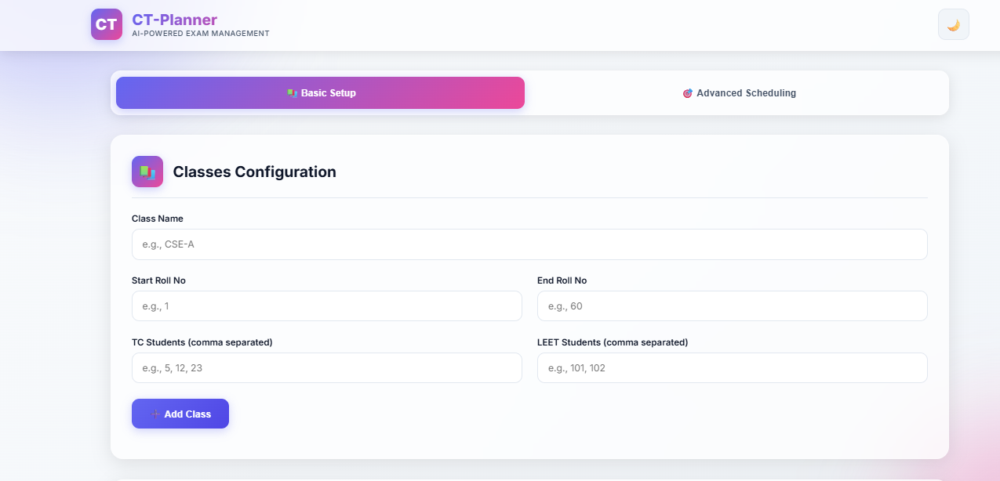
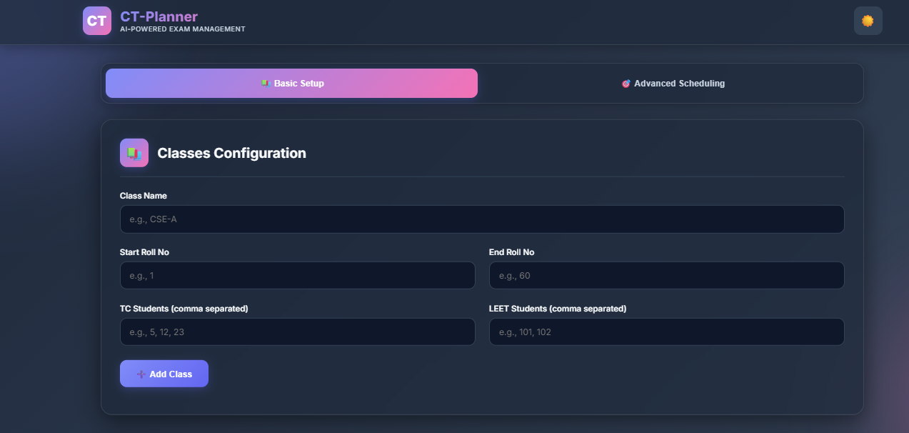
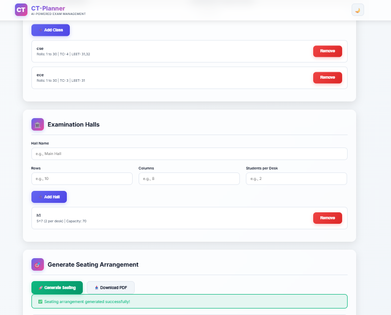
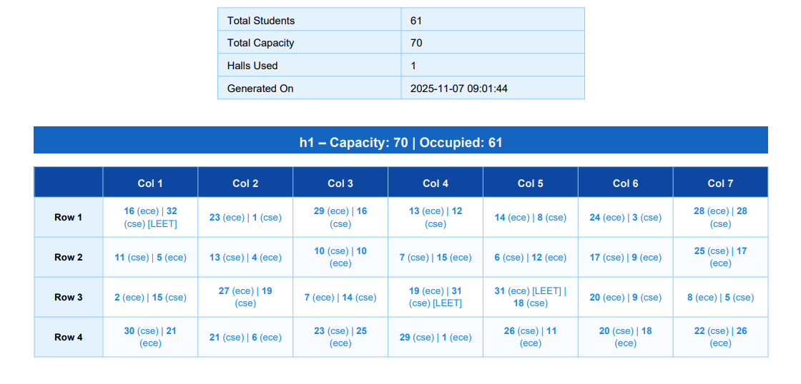
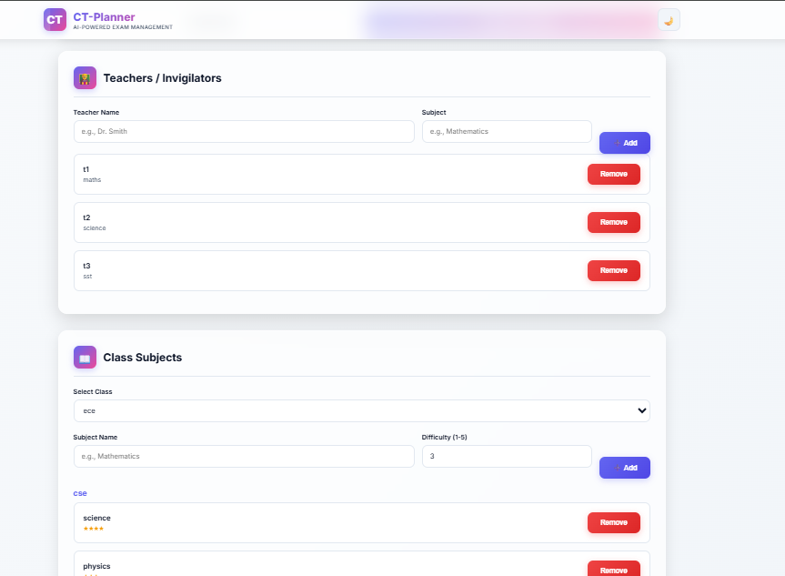
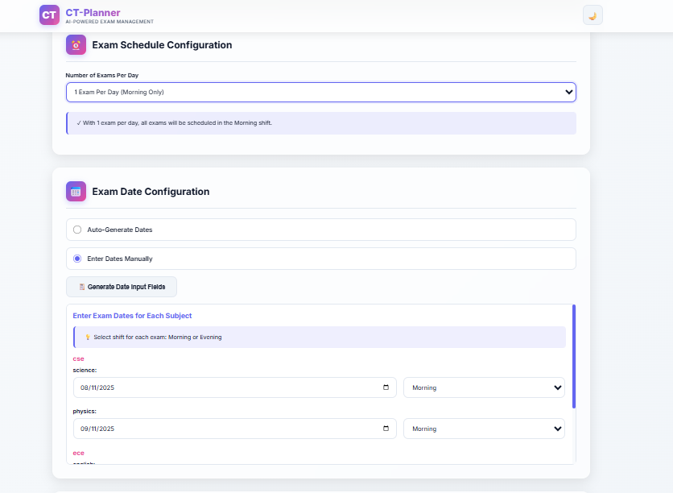
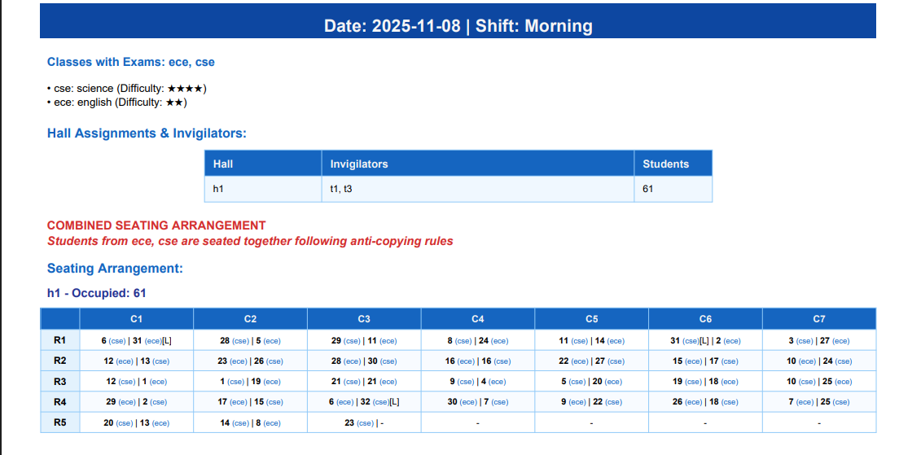
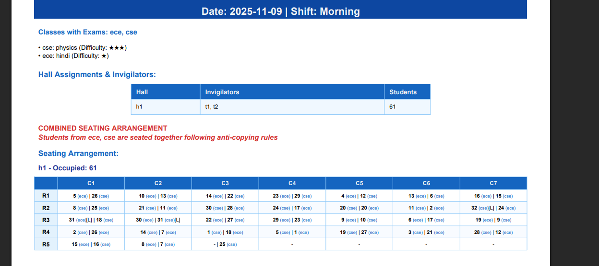

# CT-Planner: AI-Powered Exam Seating & Scheduling System

## 🎯 Problem Statement

Educational institutions face significant challenges in managing examinations:
- **Manual Seating Arrangements**: Hours spent creating anti-copying seating plans
- **Schedule Conflicts**: Difficulty in coordinating multiple exams, halls, and invigilators
- **Resource Optimization**: Inefficient use of examination halls and teacher assignments
- **Error-Prone Process**: Manual processes lead to mistakes and conflicts

## 💡 Our Solution

CT-Planner is an intelligent, AI-powered examination management system that automates the entire process from seating arrangement to schedule generation, ensuring:
- ✅ Zero same-class students sitting adjacent to each other
- ✅ Optimal hall utilization with smart student distribution
- ✅ Automated invigilator assignments avoiding conflicts
- ✅ Complete datesheet generation with PDF exports
- ✅ Support for LEET students and TC (Transfer Certificate) exclusions

---

## 👥 Team Information

**Team Name**: Cobra Tech

| Name | Role | Contact |
|------|------|---------|
| Nikhil Rana | Full Stack Developer | nickrajput716@gmail.com |
| Ansal | UI/UX Designer | ansalkumar14@gmail.com |
| Shubham | UI/UX Designer | subham4492@gmail.com |
| Priyanshu | UI/UX Designer | priyanshu5555@gmail.com |

**College**: ABVGIET Pragatinagar  
**Department**: CSE

---

## 🚀 Key Features

### 📚 Basic Seating Management
- **Smart Class Configuration**: Define multiple classes with roll number ranges
- **TC Student Exclusion**: Automatically exclude transferred/left students
- **LEET Student Integration**: Special handling for lateral entry students
- **Multi-Hall Support**: Configure unlimited examination halls with custom layouts

### 🎯 Intelligent Seating Algorithm
- **Anti-Copying Rules**: Ensures no same-class students sit adjacent (horizontally or on same desk)
- **Vertical Distribution**: Smart column-wise class distribution for better monitoring
- **Retry Mechanism**: Multiple attempts to achieve 100% placement with constraint satisfaction
- **Backtracking**: Advanced algorithm for placing remaining students while maintaining all rules

### 📅 Advanced Scheduling System
- **Auto Date Generation**: Intelligent date assignment based on subject difficulty
- **Manual Date Entry**: Flexibility to manually assign exam dates
- **Multi-Shift Support**: 1 or 2 exams per day (Morning/Evening shifts)
- **Combined Seating**: Single seating arrangement per time slot for all classes
- **Conflict Avoidance**: Teachers don't invigilate their own subject exams

### 👨‍🏫 Invigilator Management
- **Smart Assignment**: Automatic teacher allocation to halls
- **Conflict Prevention**: Teachers assigned based on subject non-overlap
- **Configurable Strength**: Customize invigilators per hall
- **One Hall Rule**: Each teacher assigned to only one hall at a time

### 📄 Professional PDF Generation
- **Complete Datesheet**: Comprehensive exam schedule with all details
- **Hall-wise Seating Plans**: Detailed seating arrangements for each hall
- **Invigilator Assignments**: Clear duty allocation for teachers
- **Beautiful Design**: Professional, print-ready PDF documents with modern styling

### 🎨 Modern UI/UX
- **Dark/Light Theme**: Toggle between themes for comfortable viewing
- **Responsive Design**: Works seamlessly on desktop, tablet, and mobile
- **Glass Morphism**: Modern, beautiful interface with animated backgrounds
- **Real-time Feedback**: Instant validation and error messages

---

## 🛠️ Tech Stack

### Backend
- **Python 3.8+**: Core programming language
- **Flask 2.0+**: Lightweight web framework
- **NumPy**: Numerical computations for seating algorithms
- **Pandas**: Data manipulation and analysis
- **scikit-learn**: Machine learning utilities (StandardScaler, KMeans)

### PDF Generation
- **ReportLab**: Professional PDF document creation
- **Custom Algorithms**: Smart table layouts and styling

### Frontend
- **HTML5**: Semantic markup
- **CSS3**: Modern styling with CSS variables
- **Vanilla JavaScript**: No framework overhead, pure performance
- **Google Fonts (Inter)**: Beautiful typography

### Algorithm Design
- **Constraint Satisfaction Problem (CSP)**: Core seating arrangement logic
- **Backtracking Algorithm**: For optimal student placement
- **Greedy Heuristics**: Smart column selection and class distribution
- **Graph-based Scheduling**: Exam date optimization

---

## 📦 Installation & Setup

### Prerequisites
```bash
Python 3.8 or higher
pip (Python package manager)
Git
```

### Clone the Repository
```bash
git clone https://github.com/nickrajput716/CT-PLANNERS.git
```

### Install Dependencies
```bash
cd seating-planner
pip install -r requirements.txt
```

### Project Structure
```
ct-planner/
│
├── app.py                  # Flask application entry point
├── seating_model.py        # Core seating & scheduling algorithms
├── requirements.txt        # Python dependencies
├── runtime.txt             # Python dependencies
├── README.md               # Project documentation
│
├── templates/
│   └── index.html         # Main HTML interface
│
├── static/                # Static assets (if any)
│
└── output/                # Generated PDF files (auto-created)
```

### Run Locally
```bash
python app.py
```

The application will start on `http://localhost:500`

---

## 🎮 How to Use

### Step 1: Configure Classes
1. Navigate to **"Basic Setup"** tab
2. Enter class details (name, roll numbers, TC students, LEET students)
3. Click **"Add Class"** for each class

### Step 2: Configure Examination Halls
1. Enter hall name and dimensions (rows × columns)
2. Specify students per desk
3. Click **"Add Hall"**

### Step 3: Generate Basic Seating
1. Click **"Generate Seating"** button
2. View the smart seating arrangement
3. Download PDF for printing

### Step 4: Advanced Scheduling (Optional)
1. Switch to **"Advanced Scheduling"** tab
2. Add teachers with their subjects
3. Configure class subjects with difficulty levels
4. Choose auto or manual date assignment
5. Set invigilators per hall
6. Click **"Generate Complete Schedule"**
7. Download comprehensive PDF

---

## 📸 Screenshots

<div align="center">

### 🏠 Landing Page & Interface

<table>
  <tr>
    <td align="center" width="50%">
      
      <br />
      <b>Home Screen - Light Theme</b>
      <br />
      <em>Clean, modern interface with glass morphism design</em>
    </td>
    <td align="center" width="50%">
      
      <br />
      <b>Dark Theme Interface</b>
      <br />
      <em>Beautiful dark mode for comfortable viewing</em>
    </td>
  </tr>
</table>

### 📚 Class & Hall Configuration

<table>
  <tr>
    <td align="center" width="50%">
      
      <br />
      <b>Class Setup</b>
      <br />
      <em>Configure classes with TC and LEET students</em>
    </td>
    <td align="center" width="50%">
      
      <br />
      <b>Examination Halls</b>
      <br />
      <em>Define halls with custom layouts</em>
    </td>
  </tr>
</table>

### 🎯 Seating Arrangement Generation

<table>
  <tr>
    <td align="center" width="50%">
      
      <br />
      <b>Seating Generation</b>
      <br />
      <em>AI-powered smart seating arrangement</em>
    </td>
    <td align="center" width="50%">
      
      <br />
      <b>Generated Seating Plan</b>
      <br />
      <em>Hall-wise seating with anti-copying rules</em>
    </td>
  </tr>
</table>

### 📅 Advanced Scheduling Features

<table>
  <tr>
    <td align="center" width="50%">
      
      <br />
      <b>Complete Exam Scheduling</b>
      <br />
      <em>Teachers, subjects, and date configuration</em>
    </td>
    <td align="center" width="50%">
      
      <br />
      <b>Generated Schedule</b>
      <br />
      <em>Complete datesheet with invigilator assignments</em>
    </td>
  </tr>
</table>

### 📄 PDF Output

<table>
  <tr>
    <td align="center" width="100%">
      
      <br />
      <b>Professional PDF Documents</b>
      <br />
      <em>Print-ready seating arrangements and schedules</em>
    </td>
  </tr>
</table>

</div>

---

## 🧮 Algorithm Highlights

### Seating Constraint Rules (ALL CRITICAL)
1. **Same Desk Rule**: No two students from same class on same desk
2. **Horizontal Neighbor Rule**: No same-class students sitting horizontally adjacent
3. **Vertical Distribution**: Prefer continuing same class in columns for better distribution

### Algorithm Flow
```
1. Create student dataset (excluding TC, including LEET)
2. Shuffle students for randomization
3. For each hall:
   a. Distribute students across rows and columns
   b. Apply constraint checking for each placement
   c. Use smart column selection (vertical distribution)
   d. Retry mechanism (up to 8 attempts) if constraints fail
   e. Backtracking for remaining students (if ≤15 left)
4. Generate visualization and PDF
```

### Scheduling Algorithm
```
1. Sort subjects by difficulty (hardest first)
2. Auto-generate or use manual dates
3. Group exams by time slot (date + shift)
4. Generate SINGLE combined seating per slot
5. Assign invigilators avoiding subject conflicts
6. Ensure one teacher per hall per slot
7. Create comprehensive PDF with all details
```

---

## 🎯 Impact & Benefits

### For Students
- ✅ Fair examination seating
- ✅ Clear exam schedule visibility
- ✅ Reduced anxiety about exam dates

### For Faculty
- ⏱️ **90% Time Savings** in arrangement creation
- 📉 **Zero Manual Errors** in seating/scheduling
- 📱 Easy-to-use interface requiring no technical knowledge

### For Administration
- 💰 **Resource Optimization** through smart hall utilization
- 📊 Professional PDF reports for record-keeping
- 🔄 Scalable solution for any institution size

---

## 🚀 Deployed on Render

Live Application: `https://ct-planners-8.onrender.com/`

---

## 🔮 Future Enhancements

- [ ] **Room conflict detection** with timetable integration
- [ ] **Student analytics** dashboard
- [ ] **Multi-language support** (Hindi, regional languages)
- [ ] **Mobile app** for on-the-go access
- [ ] **Email notifications** to students and teachers
- [ ] **QR code** based attendance tracking
- [ ] **Integration** with existing ERP systems
- [ ] **AI-powered** exam difficulty prediction
- [ ] **Historical data** analysis and insights

---

## 🐛 Known Issues & Limitations

1. **High Constraint Scenarios**: With very limited halls and many classes, placement might fail
   - Solution: Add more halls or increase students per desk
   
2. **Browser Storage**: Not using localStorage for data persistence
   - All data resets on page refresh (intentional for demo)
   
3. **PDF Size**: Large institutions may generate very large PDFs
   - Consider splitting by date/hall for very large schedules

---

## 📞 Contact & Support

- **Email**: nickrajput716@gmail.com
- ** GitHub Issues**: [Create an issue](https://github.com/nickrajput716)

---

## ⭐ Show Your Support

If you found this project helpful, please consider giving it a ⭐ on GitHub!

---

<div align="center">

**Made with ❤️ by Cobra Tech**

*Simplifying Examination Management, One Schedule at a Time*


</div>

